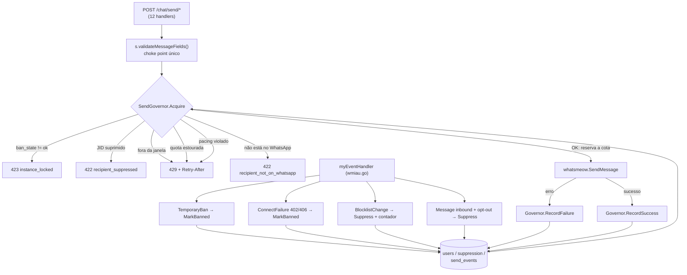

# Anti-Ban Guardrails — Design

**Spec**: `.specs/features/anti-ban-guardrails/spec.md`
**Context**: `.specs/features/anti-ban-guardrails/context.md`
**Status**: Draft

---

## Architecture Overview

Um **gate único** (`SendGovernor`) entre o handler HTTP e o whatsmeow, e um
**coletor de sinais** no event handler que alimenta o estado do gate. Tudo
persistido no banco do próprio wuzapi — o estado sobrevive a restart e é
consistente entre réplicas.



**Por que o gate vive dentro de `validateMessageFields` e não num middleware
`alice`:** o middleware roda antes do body ser lido, e o gate precisa do
destinatário (para supressão e pré-flight). Ler e rebufferizar o body num
middleware para 12 handlers é mais frágil que usar o choke point que já existe —
os 12 handlers de envio **já** chamam `validateMessageFields` (`handlers.go:1023,
1193, 1399, 1592, 1757, 1932, 2055, 2254, 2554, 2765, 2907, 3046`). Nenhum envio
escapa dele.

### Approach exploration

| Abordagem | Prós | Contras | Veredito |
| --- | --- | --- | --- |
| **A. Gate síncrono em `validateMessageFields`, rejeita com 4xx** | Choke point já existe; contrato REST intacto; zero mudança de semântica para consumidores atuais; testável com `httptest` | Cliente precisa saber reagir a 423/429/422 | ✅ **Escolhida** |
| B. Fila interna no gateway, `202 Accepted` + `jobId` | Cliente vira fire-and-forget; ritmo perfeito | Muda o contrato dos 12 endpoints; exige worker, storage de job, endpoint de status; quebra o broadcast-app hoje | Deferida (v2) |
| C. Gate em middleware `alice` no router | Separação limpa | Precisa ler/rebufferizar o body para achar o `Phone`; duplica parsing de 12 payloads distintos | Rejeitada |

A escolha A já foi travada com o usuário (ver `context.md` → "Contrato de erro").

---

## Code Reuse Analysis

### Componentes existentes a aproveitar

| Componente | Local | Como usar |
| --- | --- | --- |
| `validateMessageFields` | `handlers.go:6226` | Vira método de `*server`; hospeda a chamada ao gate. Único ponto a tocar para cobrir 12 endpoints. |
| `normalizeBrazilianJID` | `wmiau.go:403` | Generalizar para `resolveRecipientJID`: hoje só chama `IsOnWhatsApp` para celular BR ambíguo (`wmiau.go:406-412`); passa a checar registro para todo `DefaultUserServer`. |
| `phoneJIDCache` | `main.go:81` (`cache.New(24h, 1h)`) | Já é o cache certo. Estender o valor guardado para incluir "não existe" (negative caching), evitando reconsultar inválidos. |
| `migrations.go` | `migrations.go:19` | Mecanismo de migração pronto. Próximo ID livre = **10**. |
| `s.Respond(w, r, status, err)` | `helpers.go` | Formato de resposta já padronizado — o gate devolve por ele. |
| `sendEventWithWebHook(mycli, postmap, path)` | `wmiau.go:161` | Despacho de webhook com filtro de assinatura. Reusar para `TemporaryBan` enriquecido, `InstancePaused`, `OptOut`. |
| `supportedEventTypes` | `constants.go:4` | Já lista `TemporaryBan`, `BlocklistChange`, `ConnectFailure`. Só faltam os novos: `InstancePaused`, `OptOut`, `ContentRepetitionWarning`. |
| `makeTestServer(t)` | `stdio_test.go:378` | SQLite `:memory:` + `initializeSchema` + `s.routes()`. É o harness dos testes do governor. |
| `safeGo(name, fn)` | `wmiau.go:48` | Para o `MarkRead` atrasado e despachos assíncronos sem risco de panic derrubar o processo. |
| `db.Rebind(query)` | usado em `wmiau.go:983` | Obrigatório: o mesmo SQL roda em SQLite (`?`) e Postgres (`$1`). |

### Pontos de integração

| Sistema | Método de integração |
| --- | --- |
| Banco (SQLite/Postgres) | Migration 10 adiciona colunas em `users` + 2 tabelas novas. Sem quebrar schema existente. |
| whatsmeow event stream | Novos `case` em `myEventHandler` (`wmiau.go:836`); os tipos já existem, só estavam sendo ignorados. |
| broadcast-app | Reage aos status 423/429/422 no loop `runBroadcast` e assina os eventos novos em `src/lib/instance.ts:24`. |

---

## Components

### SendGovernor

- **Purpose**: decidir, para um par (instância, destinatário), se um envio pode
  sair agora — e reservar a cota atomicamente quando pode.
- **Location**: `governor.go` (novo)
- **Interfaces**:
  - `NewSendGovernor(db *sqlx.DB, defaults GovernorDefaults) *SendGovernor`
  - `Acquire(ctx, userID string, recipient types.JID, kind SendKind) *GateError` — nil = liberado
  - `RecordSuccess(userID string)` — zera `consecutive_failures`
  - `RecordFailure(userID string)` — incrementa; dispara auto-pausa no 5º
  - `MarkBanned(userID, state string, code int, reason string, until time.Time) error`
  - `ClearBan(userID string) error`
  - `Health(userID string) (InstanceHealth, error)`
- **Dependencies**: `sqlx.DB`, relógio injetável (`func() time.Time`) para testes
- **Reuses**: `db.Rebind`, padrão de erro de `s.Respond`

**Ordem de avaliação em `Acquire`** (a primeira que barrar responde — mais barata
e mais grave primeiro):

1. `ban_state != 'ok'` e `ban_until` no futuro → **423**
2. destinatário em `suppression` → **422**
3. fora da janela horária → **429**
4. quota diária esgotada → **429**
5. `last_send_at` mais recente que `min_interval_ms` → **429**
6. destinatário não registrado no WhatsApp → **422**

O passo 6 vem por último de propósito: é o único que faz I/O de rede
(`IsOnWhatsApp`), então só é pago quando todos os gates locais passaram.

**`SendKind`** determina quais gates se aplicam:

| Kind | Handlers | Ban | Supressão | Janela | Quota | Pacing | Pré-flight |
| --- | --- | --- | --- | --- | --- | --- | --- |
| `KindOutbound` | text, image, video, audio, document, sticker, contact, location, buttons, list | ✅ | ✅ | ✅ | ✅ | ✅ | ✅ |
| `KindEdit` | `/chat/send/edit` | ✅ | — | — | — | — | — |
| `KindGroup` | `/chat/send/poll` e alvos `@g.us` | ✅ | — | ✅ | ✅ | ✅ | — |

Editar uma mensagem já enviada não é um novo contato: não consome cota. Grupo não
tem opt-out individual nem `IsOnWhatsApp`.

### GateError

- **Purpose**: carregar status HTTP + corpo estruturado para o handler devolver.
- **Location**: `governor.go`
- **Interfaces**:
  ```go
  type GateError struct {
      Status     int           // 423 | 429 | 422
      Code       string        // "instance_banned" | "quota_exceeded" | ...
      Reason     string        // legível
      RetryAfter time.Duration // 429 → header Retry-After
      Until      *time.Time    // 423 → quando destrava
  }
  func (e *GateError) Error() string
  func (e *GateError) WriteTo(w http.ResponseWriter, s *server, r *http.Request)
  ```
- **Dependencies**: nenhuma além de `net/http`

### Reserva atômica de cota

O coração do AC "duas requisições concorrentes nunca passam as duas". Mutex em Go
**não** basta (não protege entre réplicas do container); a atomicidade precisa
estar no banco:

```sql
UPDATE users SET
    sent_today     = CASE WHEN quota_reset_at <= :now THEN 1 ELSE sent_today + 1 END,
    quota_reset_at = CASE WHEN quota_reset_at <= :now THEN :next_midnight ELSE quota_reset_at END,
    last_send_at   = :now
WHERE id = :user_id
  AND (quota_reset_at <= :now OR sent_today < :quota)
  AND (last_send_at IS NULL OR last_send_at <= :pacing_deadline)
```

`RowsAffected() == 0` significa que quota **ou** pacing barrou. Só então o
governor faz um `SELECT` para descobrir qual dos dois foi, e monta o `GateError`
com o `Retry-After` correto. O caminho feliz é um único `UPDATE`.

> Compatível com SQLite e Postgres sem SQL condicional por dialeto — desde que
> passe por `db.Rebind`.

### SuppressionStore

- **Purpose**: bloquear envio para quem pediu para sair, bloqueou, ou foi
  suprimido manualmente.
- **Location**: `suppression.go` (novo)
- **Interfaces**:
  - `Suppress(userID string, jid types.JID, reason string) error` — idempotente (upsert)
  - `IsSuppressed(userID string, jid types.JID) (bool, string, error)`
  - `Unsuppress(userID string, jid types.JID) error`
  - `List(userID string) ([]SuppressionEntry, error)`
- **Dependencies**: `sqlx.DB`
- **Reuses**: padrão de `INSERT ... ON CONFLICT DO NOTHING` já usado em
  `saveMessageToHistory` (ver `db_history_test.go`)

### matchOptOut

- **Purpose**: decidir se um texto de entrada é um pedido de descadastro.
- **Location**: `optout.go` (novo) — função pura, sem dependências
- **Interfaces**: `matchOptOut(text string) bool`
- **Comportamento**: normaliza (trim → minúsculas → remove acentos → remove
  pontuação → colapsa espaços) e compara por **igualdade exata** com o conjunto
  `{sair, parar, pare, stop, descadastrar, cancelar, remover}`.
  `"não quero parar de receber"` → `false` (não é substring match, é o texto inteiro).

### resolveRecipientJID

- **Purpose**: generalizar a resolução de destinatário para incluir verificação de
  registro no WhatsApp, com cache positivo e negativo.
- **Location**: `wmiau.go` (modifica `normalizeBrazilianJID`)
- **Interfaces**:
  `resolveRecipientJID(client, recipient types.JID) (types.JID, RecipientStatus)`
  onde `RecipientStatus ∈ {Registered, NotRegistered, Unknown}`
- **Comportamento**:
  - `Server != DefaultUserServer` → `(recipient, Unknown)`, no-op
  - cache hit → devolve direto (positivo ou negativo)
  - variantes BR: mantém a lógica de `brazilianMobileVariants`
  - não-BR: consulta `IsOnWhatsApp([digits])`
  - erro/timeout → `(recipient, Unknown)` + warning; **nunca** piora o envio
- **Reuses**: `brazilianMobileVariants` (`wmiau.go:375`), `phoneJIDCache`

### Coletores de sinal (event handler)

- **Location**: `wmiau.go`, dentro de `myEventHandler`
- **Mudanças**:

| Evento | Linha atual | Novo comportamento |
| --- | --- | --- |
| `TemporaryBan` | `wmiau.go:1662` | Persiste `ban_state='temp'`, código, razão, `until = now + Expire` (0 → 24 h); enriquece o webhook com `code`/`reason`/`expire`; `client.Disconnect()` |
| `ConnectFailure` | `wmiau.go:1618` | Mapeia `402 TempBanned` → `temp`, `406 UnknownLogout` → `perm`, `403 MainDeviceGone` → `perm`; adiciona `reasonCode`/`reasonName` ao webhook |
| `BlocklistChange` | `wmiau.go:1642` | `Suppress(reason='blocked')` + insere em `send_events(kind='block')`; avalia auto-pausa |
| `Message` (entrada) | `wmiau.go:974` | Se `matchOptOut(texto)` → `Suppress(reason='opt_out')` + webhook `OptOut` |

---

## Data Models

### Migration 10 — `add_anti_ban_state`

Colunas novas em `users` (todas com default, migração não-destrutiva):

```sql
ALTER TABLE users ADD COLUMN ban_state             TEXT    DEFAULT 'ok';   -- ok|temp|perm|self_paused
ALTER TABLE users ADD COLUMN ban_code              INTEGER DEFAULT 0;
ALTER TABLE users ADD COLUMN ban_reason            TEXT    DEFAULT '';
ALTER TABLE users ADD COLUMN ban_until             TIMESTAMP;
ALTER TABLE users ADD COLUMN sent_today            INTEGER DEFAULT 0;
ALTER TABLE users ADD COLUMN quota_reset_at        TIMESTAMP;
ALTER TABLE users ADD COLUMN last_send_at          TIMESTAMP;
ALTER TABLE users ADD COLUMN warmup_started_at     TIMESTAMP;
ALTER TABLE users ADD COLUMN max_daily_quota       INTEGER DEFAULT 0;   -- 0 = usar padrão global
ALTER TABLE users ADD COLUMN min_interval_ms       INTEGER DEFAULT 0;   -- 0 = usar padrão global
ALTER TABLE users ADD COLUMN window_start          TEXT    DEFAULT '';  -- "09:00"
ALTER TABLE users ADD COLUMN window_end            TEXT    DEFAULT '';  -- "20:00"
ALTER TABLE users ADD COLUMN send_timezone         TEXT    DEFAULT '';  -- "America/Sao_Paulo"
ALTER TABLE users ADD COLUMN consecutive_failures  INTEGER DEFAULT 0;
ALTER TABLE users ADD COLUMN simulate_typing       INTEGER DEFAULT 1;
ALTER TABLE users ADD COLUMN device_os             TEXT    DEFAULT '';
ALTER TABLE users ADD COLUMN device_platform       TEXT    DEFAULT '';
```

> Seguir o padrão da migration 2 (`add_proxy_url`): bloco `DO $$` para Postgres +
> tratamento em código para SQLite.

```sql
CREATE TABLE IF NOT EXISTS suppression (
    user_id    TEXT NOT NULL,
    jid        TEXT NOT NULL,
    reason     TEXT NOT NULL,          -- opt_out | blocked | manual
    created_at TIMESTAMP NOT NULL,
    PRIMARY KEY (user_id, jid)
);

CREATE TABLE IF NOT EXISTS send_events (
    id         INTEGER PRIMARY KEY AUTOINCREMENT,
    user_id    TEXT NOT NULL,
    kind       TEXT NOT NULL,          -- sent | failed | block
    body_hash  TEXT DEFAULT '',        -- SHA-256 do corpo normalizado (BAN-24)
    created_at TIMESTAMP NOT NULL
);
CREATE INDEX IF NOT EXISTS send_events_user_time_idx ON send_events (user_id, created_at);
```

`suppression` tem PK composta `(user_id, jid)` — a checagem por envio é um lookup
de índice, atendendo ao edge case das 100 000 entradas.

`send_events` alimenta as janelas de 24 h (taxa de bloqueio) e a janela deslizante
de repetição de conteúdo. Precisa de **poda**: um `DELETE FROM send_events WHERE
created_at < now-7d` no boot e a cada 6 h, senão vira tabela infinita.

### GovernorDefaults

```go
type GovernorDefaults struct {
    MaxDailyQuota  int           // 200
    MinInterval    time.Duration // 45s — piso absoluto, config só pode subir
    WindowStart    string        // "09:00"
    WindowEnd      string        // "20:00"
    Timezone       string        // "America/Sao_Paulo"
    SkipSunday     bool          // true
    WarmupRamp     []RampStep    // {0,30},{2,60},{4,100},{7,150},{14,200}
    BlockRateLimit float64       // 0.015
    BlockMinCount  int           // 3
    MaxConsecutiveFailures int   // 5
}
```

Cada campo tem flag em `main.go` + override por env, seguindo o padrão existente
(`osName` em `main.go:53` + override em `main.go:276-278`).

---

## Error Handling Strategy

| Cenário | Tratamento | Impacto no consumidor |
| --- | --- | --- |
| Instância banida (temp/perm) ou auto-pausada | `423` + `{code, reason, until}` | Cliente pausa a campanha até `until` |
| Quota diária esgotada | `429` + `Retry-After` até a virada do dia | Cliente reagenda para amanhã |
| Pacing violado | `429` + `Retry-After` em segundos | Cliente espera e **repete o mesmo destinatário** |
| Fora da janela horária | `429` + `Retry-After` até a abertura | Cliente reagenda |
| Destinatário não está no WhatsApp | `422` + `{error, phone}` | Cliente marca `skipped` e segue |
| Destinatário suprimido | `422` + `{error, reason}` | Cliente marca `skipped` e segue |
| `IsOnWhatsApp` falha (rede) | Warning + envia com o JID original | Nenhum — degradação silenciosa e segura |
| `SendChatPresence` falha | Warning + envia mesmo assim | Nenhum |
| Banco indisponível no `Acquire` | **Fail-closed**: `503` e não envia | Cliente reagenda |

> **Fail-closed é deliberado.** Se o governor não consegue saber se a instância
> está banida ou dentro da cota, a resposta segura é não enviar. Fail-open aqui
> transformaria uma falha de banco numa rajada sem limite — exatamente o cenário
> que o feature existe para impedir.

---

## Risks & Concerns

| Preocupação | Local | Impacto | Mitigação |
| --- | --- | --- | --- |
| **CI não roda testes** — só `go vet` e `go build` | `.github/workflows/build.yml:42-46` | Toda a suíte existente (18 arquivos `_test.go`) pode quebrar sem ninguém ver; os testes deste feature seriam decorativos | **T0**: adicionar `go test ./... -race` ao workflow antes de qualquer outra tarefa |
| **Race em `store.DeviceProps`** | `wmiau.go:585-586` | Global de pacote do whatsmeow escrita a cada `startClient`; dois pareamentos simultâneos podem trocar fingerprint | Mutex global cobrindo escrita + pareamento (BAN-26). `go test -race` detecta |
| **`handlers.go` com 8 717 linhas** | `handlers.go` | Qualquer mudança transversal (como converter `validateMessageFields` em método) toca 12 pontos e é fácil errar um | Uma tarefa só para a conversão mecânica, com teste que prova que os 12 endpoints passam pelo gate |
| **`InsecureSkipVerify: true`** | `wmiau.go:607` | MITM em download de mídia e entrega de webhook | Fora de escopo (registrado em `context.md` → Deferred). Vale issue separado |
| **`send_events` cresce sem limite** | tabela nova | Disco e degradação das queries de janela de 24 h | Poda no boot + a cada 6 h (parte de T5) |
| **Zero teste cobrindo os handlers de envio hoje** | `handlers.go:2732` etc. | Não há rede de segurança para a conversão de `validateMessageFields` | Os testes e2e do gate (via `makeTestServer`) passam a ser a primeira cobertura desses endpoints |
| **`IsOnWhatsApp` universal aumenta consultas** | `wmiau.go:403` | O WhatsApp também limita essa consulta; uma base nova de 200 contatos gera 200 consultas no primeiro dia | Cache 24 h positivo **e negativo**; o app deve pré-validar a planilha em lote via `/user/check` antes do disparo (já existe) |
| **Relógio do servidor** | governor | Fuso errado quebra janela e virada de quota | Relógio injetável no governor + `time.LoadLocation` explícito, nunca `time.Local` |

---

## Tech Decisions

| Decisão | Escolha | Racional |
| --- | --- | --- |
| Onde plugar o gate | `validateMessageFields` → método de `*server` | Único ponto por onde os 12 handlers de envio já passam; middleware exigiria rebufferizar body |
| Atomicidade da cota | `UPDATE ... WHERE` condicional + `RowsAffected` | Mutex Go não protege entre réplicas; funciona igual em SQLite e Postgres |
| Comportamento sob falha de banco | Fail-closed (503) | Fail-open converteria falha de infra em rajada sem limite |
| Cache negativo em `phoneJIDCache` | Guardar `RecipientStatus`, não só `types.JID` | Sem isso, todo número inválido reconsulta o WhatsApp a cada envio |
| Estado de ban ao expirar | Limpo preguiçosamente no próximo `Acquire` | Evita goroutine de varredura; o estado só importa quando alguém tenta enviar |
| Contador de falhas | Só falhas de `whatsmeow.SendMessage`, não de gate | Um 429 não é falha da instância; contá-lo geraria auto-pausa em cascata |
| Piso de 45 s | Config só pode **aumentar** | Mesma regra já adotada no broadcast-app (`route.ts:24-27`); mantém a invariante em ambos os lados |
| Fingerprint determinístico | `hash(userID) → índice num conjunto curado` | Instância pareia sempre igual; reconexão não muda a cara do dispositivo |

> **Decisões de nível de projeto** — registrar em `.specs/STATE.md` `## Decisions`:
> AD-001 (contrato 423/429/422 para todos os endpoints de envio),
> AD-002 (fail-closed em falha de dependência de segurança),
> AD-003 (piso de intervalo só pode aumentar, nunca diminuir).
